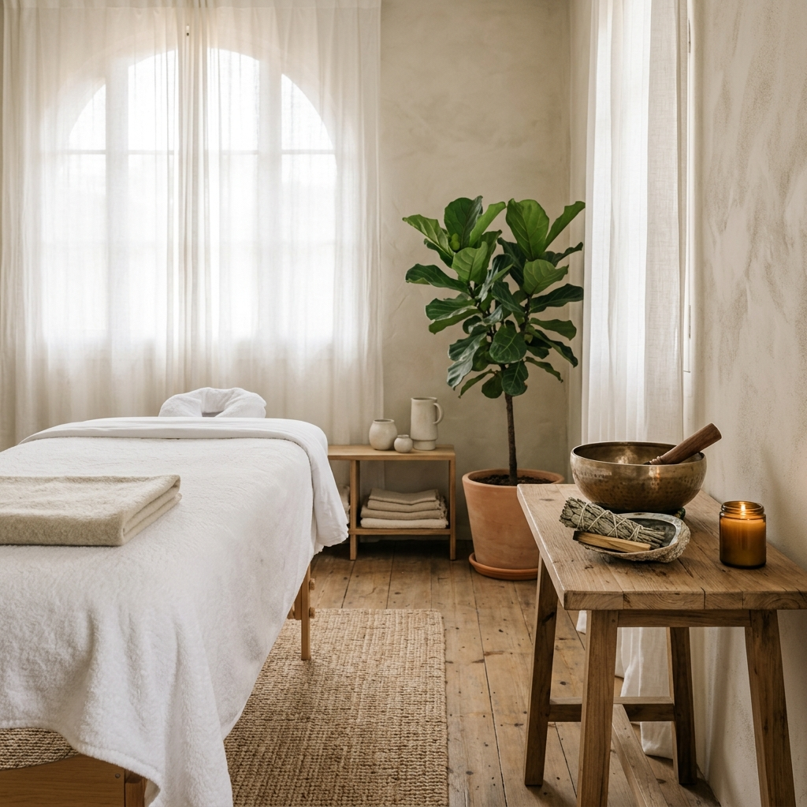

<div align="center">



# ✨ ESPACIO REIKI ✨
### Sanación Energética con Carmen Rocío

[](https://nextjs.org/)
[](https://tailwindcss.com/)
[](https://www.framer.com/motion/)
[](https://www.typescriptlang.org/)

**Una plataforma digital premium diseñada para transmitir paz, equilibrio y profesionalismo.**
*Ubicada en Dos Hermanas, Sevilla.*

---

[🌐 Visitar Sitio Web](https://espacioreiki.tumejortarifaluz.es) • [📅 Reservar Sesión](#) • [📩 Contacto](#contacto)

</div>

## 🌿 Sobre el Proyecto

**Espacio Reiki** es una experiencia digital inmersiva creada para **Carmen Rocío**, terapeuta especializada en sanación energética. El diseño busca replicar la serenidad de una sesión presencial a través de una interfaz minimalista, tipografías elegantes y transiciones suaves.

### Propósito:
- **Armonización Digital:** Crear un entorno que calme al usuario desde el primer clic.
- **Autoridad y Confianza:** Presentar la formación y trayectoria de Carmen Rocío de forma profesional.
- **Conversión Intuitiva:** Facilitar el acceso a sesiones de Reiki y formación.

## 🛠️ Stack Tecnológico

| Tecnología | Propósito |
| :--- | :--- |
| **Next.js 15** | Framework de alto rendimiento con App Router y Turbopack. |
| **React 19** | Componentes reactivos y gestión de estado moderna. |
| **Tailwind CSS** | Sistema de diseño utilitario para una estética ultra-limpia. |
| **Framer Motion** | Animaciones fluidas y micro-interacciones de lujo. |
| **Lucide Icons** | Iconografía minimalista y consistente. |

## 💎 Características Principales

- 🧘 **Diseño Holístico:** Paleta de colores inspirada en la naturaleza (sage, crema y piedra).
- 📱 **Fully Responsive:** Experiencia optimizada para móviles, tablets y escritorio.
- ⚡ **Rendimiento Pro:** Optimización de imágenes y fuentes para una carga instantánea.
- 🎨 **Tipografía Editorial:** Uso de *Cormorant Garamond* para títulos y *Inter* para lectura cómoda.
- 🔒 **Seguridad:** Implementación de headers de seguridad y buenas prácticas de SEO.

## 🚀 Instalación y Desarrollo

Si deseas clonar y ejecutar este proyecto localmente:

1. **Clonar el repositorio:**
   ```bash
   git clone https://github.com/jukk4p/EspacioReiki.git
   cd EspacioReiki
   ```

2. **Instalar dependencias:**
   ```bash
   npm install
   ```

3. **Ejecutar servidor de desarrollo:**
   ```bash
   npm run dev
   ```
   El sitio estará disponible en `http://localhost:3000`.

## 📦 Despliegue en Producción

El proyecto está configurado para un despliegue optimizado:
- **Output:** `standalone` para eficiencia en contenedores Docker.
- **Build:** `npm run build` genera una compilación optimizada con Turbopack.

---

<div align="center">
<p>Diseñado con ❤️ por <b>Antigravity</b> para Carmen Rocío.</p>
<p>© 2025 Espacio Reiki. Todos los derechos reservados.</p>
</div>
